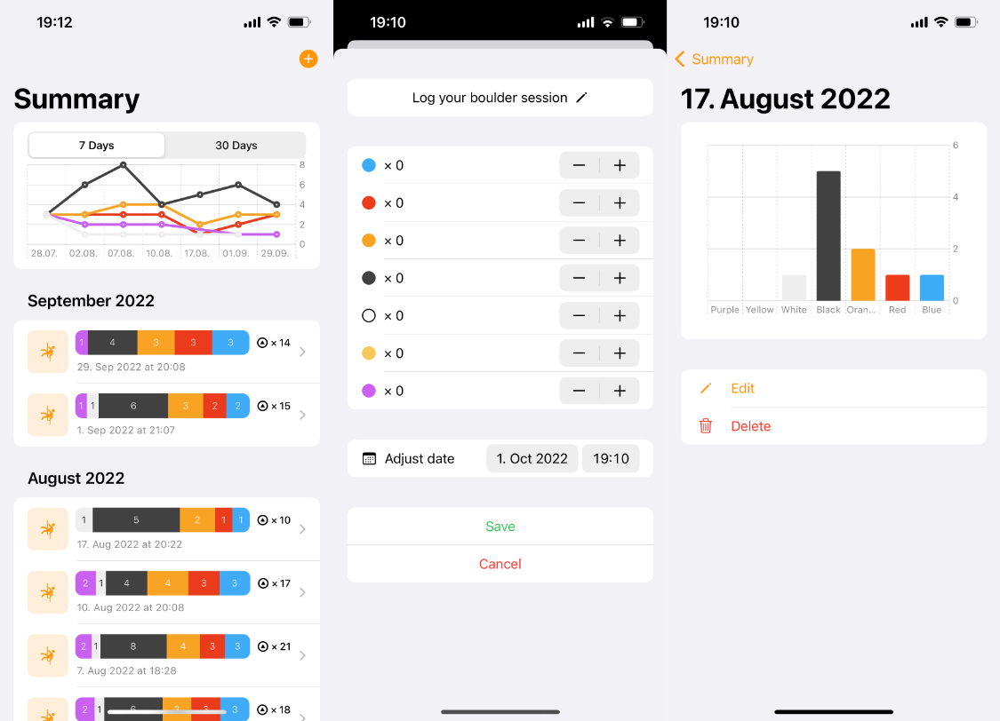

# BoulderLogbook

A logbook to track you boulder sessions.

## Features

* 📏 Allows you to set the grading scale for your gym 
* ✍️ Log all your tops for a session
* 📸 Specify whether a top was an attempt, flash (or onsight)
* 📊 Display your past sessions in a list and review your progress using charts
* 🎛️ Made a mistake? Just edit your session's tops or the date afterwards (thanks to [@ChrissisCorner](https://github.com/ChrissisCorner))

## Compatibility

* 🚀 Requires iOS 18 and Xcode 26

## Credits

* Build using the phenomenal [Composable Architecture](https://github.com/pointfreeco/swift-composable-architecture)

